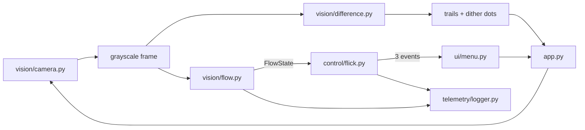

# Architecture

## I/O edges and deterministic core

Camera capture, windows, clip files, and telemetry are I/O edges. Array transforms and
gesture decisions have no I/O. `vision/flow.py` uses NumPy plus
`cv2.calcOpticalFlowFarneback`; `control/flick.py` uses only the standard library and
derives every transition from sample timestamps.

## Independent visual and control paths

Frame differencing remains only for the visual trails. It is not an input to gesture
control. Dense flow never tracks a centroid or any other position.

## Direction sample contract

`FlowState` contains:

- `mean_flow`: magnitude-weighted mean `(x, y)` flow over active pixels
- `coherence`: net vector magnitude divided by total vector magnitude
- `active_frac`: active fraction inside the gesture band
- `timestamp`: the caller-provided monotonic time

`FlickDetector` consumes a structural `DirectionSample` protocol with those fields.
A future wrist-velocity source can therefore be evaluated through the same detector
and offline harness after adapting its samples to the same units.

## Presence-gated gesture lifecycle

The detector runs through `EMPTY -> ENTRY -> SETTLE -> ARMED -> STROKE -> FIRED`.
Motion entering the band is suppressed. The detector arms only after low mean motion
persists for the configured settle period. A stroke requires coherent, axis-dominant
flow and fires after its signed impulse reaches threshold. Refractory and
opposite-direction lockouts reject the hand's return stroke.

Only `FLICK_UP`, `FLICK_DOWN`, and `SWIPE_LEFT` exist in v1.

## Reliability harness

`tools/record_clips.py` records labeled video plus per-frame timestamp sidecars.
`tools/eval_detector.py` runs the exact live pipeline offline and reports per-label
precision, recall, distractor false-positive rates, latency, and a confusion summary.
Stored baseline JSON files turn metric regressions into a nonzero process exit.
