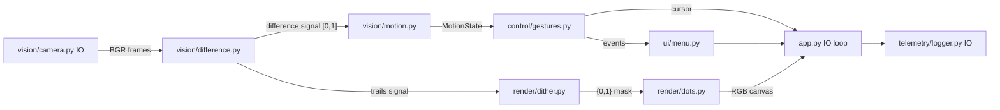

# Architecture

## The one rule: pure core, I/O edges

All pixel math, motion analysis, gesture logic, and UI state are **pure**: they
depend only on NumPy and the standard library, take arrays/values in and return
values out, and never touch a camera, a file, a window, or OpenCV. That is what
makes the whole pipeline unit-testable with synthetic arrays — no webcam needed.

OpenCV and I/O are confined to three edges:

| Edge | Responsibility |
| --- | --- |
| `vision/camera.py` | `cv2.VideoCapture` wrapper: open, read BGR frames, mirror, release |
| `telemetry/logger.py` | append timestamped JSONL records to disk |
| `app.py` | the loop: wiring, HUD text, `imshow`, key handling — **no algorithms** |

If a change makes any other module import `cv2` or open a file, it is in the
wrong place.

## Control and visualization are decoupled

Both consume the same motion signal but neither knows the other exists:

- The **control path** (`vision/motion.py` -> `control/gestures.py` -> `ui/menu.py`)
  reduces the difference signal to a `MotionState` (centroid, energy, velocity),
  then to discrete events, then to menu state.
- The **visualization path** (`vision/difference.py` trails -> `render/dither.py` ->
  `render/dots.py`) turns the same signal into the dithered dot field.

Either side can be replaced without touching the other: a different renderer sees
the same signal; a different tracker feeds the same event types into the menu.

## Module map

| Module | Pure? | What it does |
| --- | --- | --- |
| `config.py` | pure (stdlib) | `Settings` dataclass, `DitherMode` / `ColorScheme` / `Event` enums |
| `vision/difference.py` | pure | grayscale, temporal difference in `[0,1]`, `TrailsAccumulator` (`accum = max(signal, accum*decay)`) |
| `vision/motion.py` | pure | dominant-blob centroid, change energy, centroid-drift velocity -> `MotionState` |
| `vision/camera.py` | I/O | OpenCV capture wrapper |
| `control/gestures.py` | pure | debounced state machine: `MotionState` stream -> swipe/select events; analog cursor |
| `render/dither.py` | pure | Bayer (ordered) and Floyd–Steinberg dithering: signal -> `{0,1}` mask |
| `render/dots.py` | pure | vectorized mask -> colored dot canvas |
| `ui/menu.py` | pure | items, selection index, back-stack; reacts to events |
| `telemetry/logger.py` | I/O | append JSONL timestamped events |
| `app.py` | I/O | wires everything; HUD; keys |

All timing in pure modules flows through `MotionState.timestamp` — no module
calls `time.time()` except the I/O edges — so gesture tests can script exact
timelines.

## Seams left for later milestones

- **Tracker benchmark (MediaPipe):** anything that produces `MotionState` values
  can replace `MotionAnalyzer`; the gesture layer only sees the dataclass.
- **GPU renderer (moderngl/GLSL):** the renderer contract is
  `signal -> dither mask -> RGB array`; a GPU implementation replaces
  `render/` behind the same array-in/array-out boundary.
- **Select strategies:** `control/gestures.SelectDetector` is a `Protocol`;
  the default `SizeGrowSelectDetector` (blob area growing toward the camera)
  can be swapped for dwell, pinch, etc. via constructor injection.
- **HCI analysis:** every gesture, selection, and frame metric is already logged
  as JSONL by `telemetry/logger.py`; the analysis phase only needs to read it.
